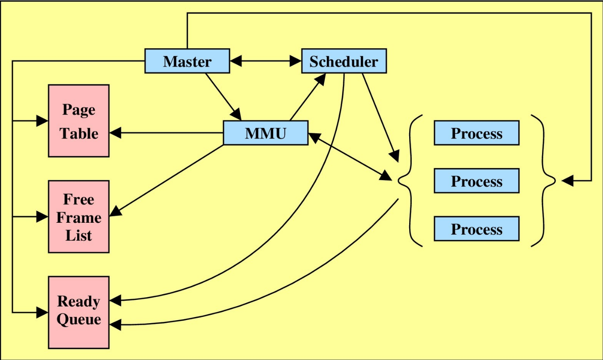

This project showcases a C-style implementation of virtual memory through (Pure) Demand Paging  
`LA8.pdf` contains the project motivation and description along with implementation of each file

_Data Structures and Interaction Diagram among different modules_
